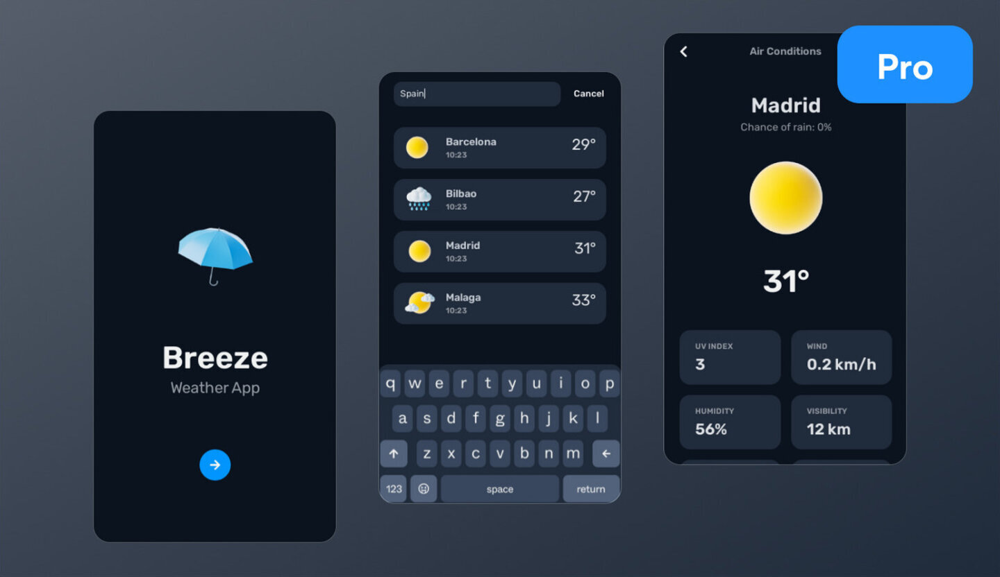

### Додаток для прогнозу погоди

Кандидату доручено створити мобільну програму прогнозу погоди за допомогою React Native Expo,
націлені як на платформи Android, так і на iOS. Програма повинна отримувати та відображати погоду в реальному часі
дані для вказаного міста за допомогою API OpenWeatherMap, включаючи температуру, вологість і загальні дані
метеорологічні умови. Користувачі повинні мати можливість вводити або вибирати місто, перемикатися між градусами Цельсія та
Фаренгейта та переглядайте зручний інтерфейс, який також ефективно обробляє стани помилок. У той час як
основна функціональність полягає в одноекранному макеті з полем введення міста та погодою
віджет, бонусні бали нараховуються за додаткові функції, такі як 5-денний прогноз, візуальний
привабливий дизайн із плавними переходами й анімацією, а також надійною обробкою помилок для крайніх випадків
і проблеми з підключенням. У проекті слід акцентувати увагу на чистому, модульному коді, чіткому розділенні UI
і бізнес-логіки, а також використання сучасних методологій React Native. Після завершення канд
Очікується, що він опублікує код у загальнодоступному сховищі та може отримати визнання інноваційним
і чуйний інтерфейс користувача.

[Пропоновані активи Figma](https://www.figma.com/community/file/1268865175425298807)

## Успішні кандидати

- Володіти гострим аналітичним розумом із сильним розумовим розумінням складних проблем
- Глибоко залучайтеся до інтелектуальних проблем і виявляйте комфорт у вирішенні складних проблем
- Ефективно керуйте кількома завданнями та точками зору, погоджуйте та визначайте пріоритети одночасно
- Excel в автономних робочих середовищах, ефективна робота без прямого нагляду
- Розуміти та дотримуватися неявних стандартів і конвенцій у всіх аспектах роботи
- Практикуйте та втілюйте принцип прискіпливої уваги до деталей на всіх рівнях
- Постійно визначайте пріоритети та постачайте високоякісний, масштабований і продуктивний код
- Мати глибоке розуміння процесів, на які впливає їхній код і якими вони керують
- Дотримуйтесь ретельного тестування та гарантії якості, щоб забезпечити досконалість продукції
- Розробити та впровадити комплексні механізми обробки помилок і журналювання
- Поважайте та цінуйте сприйняття інших у їхніх результатах і співпраці
- Ефективно керувати часом, щоб дотримуватись термінів і виконувати власні зобов’язання
- Вміло проектувати та розробляти поважні та зручні інтерфейси додатків (тільки FE)
- Чудово розуміти основні загрози безпеці і, таким чином, може створювати захищені системи (тільки для BE)
